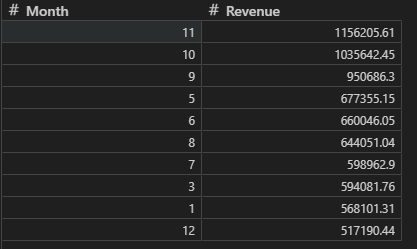
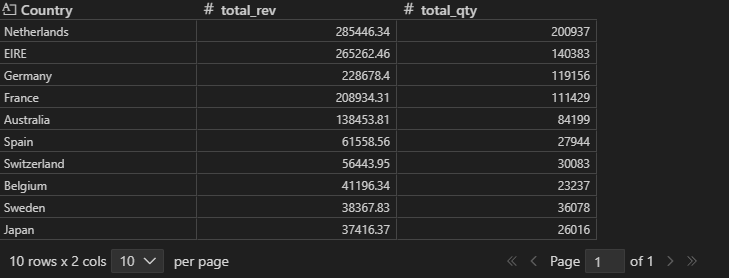
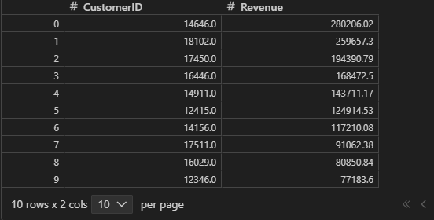
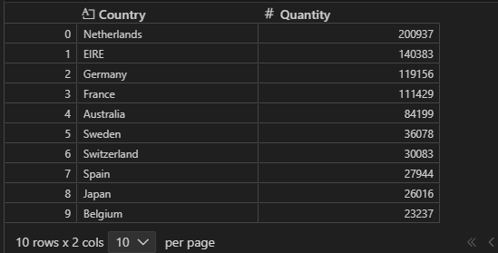
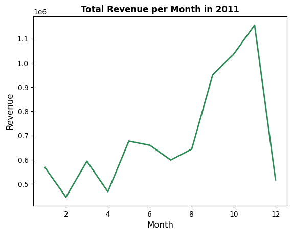
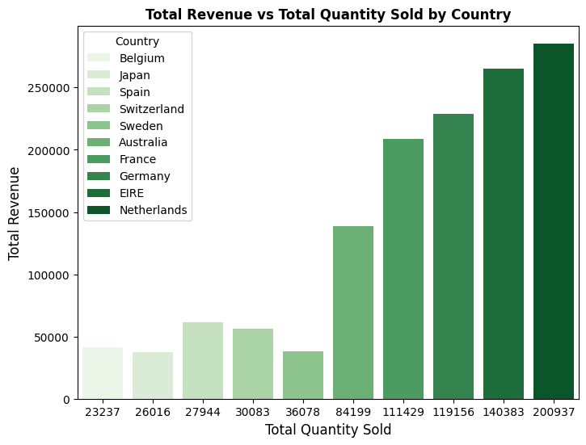
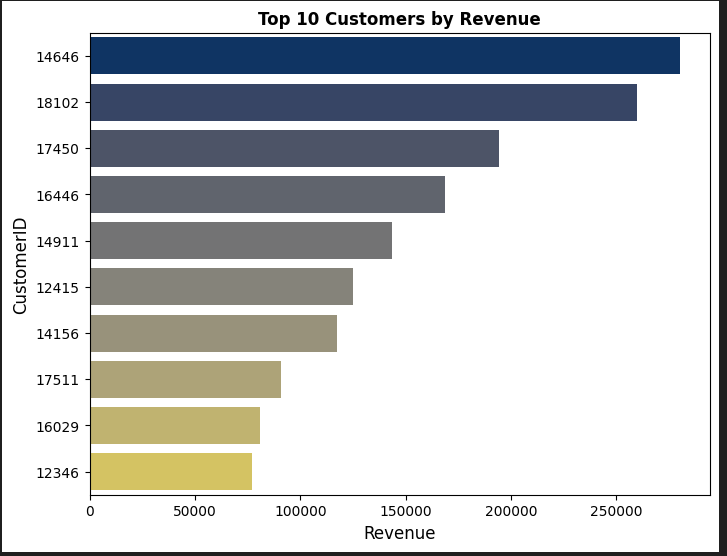
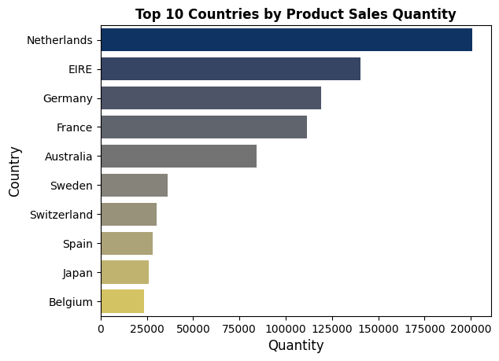

# Online Retail Dataset Analysis
## Introduction
This is a project analyzing the Online Retail Dataset as part of my journey as a data analyst in the Lux Dev Bootcamp.
The dataset provides insight into market trends, customer buying power, and revenue patterns across different countries and time periods. 
The goal is to understand revenue behavior, quantity sold,customer spending patterns across the year , as well product demand based on quantity sold in different countries.

___
## Problem Statement
1. Which countries generate the highest revenue?
2. Which countries sell the highest quantity of products?
3. Which countries have the highest-spending customers?
4. Which countries have the strongest product demand?
5. What are the seasonal patterns of revenue by month in the year 2011?

___
## Skills Demonstrated
1. Data cleaning and manipulation using Python (Pandas)
2. Data visualization using Seaborn and Matplotlib
3. Using PostgreSQL for data storage and retrieval
4. Importing and accessing data from PostgreSQL in Python
5. Data preparation and cleaning
6. Data sourcing from Excel files
7. Data transformation from Excel to SQL (PostgreSQL)

___
## Analysis
### 1. Time Series / Seasonal Patterns (Revenue in 2011)

- November recorded the highest revenue in 2011.
 - December recorded the lowest revenue.
- Revenue started low at the beginning of the year, increased steadily from May to November, then dropped sharply in December.

### 2. Top Revenue-Generating Countries & Quantity Sold

- Netherlands generated the highest total revenue and sold the highest quantity of products.
- Other high-performing countries include EIRE, Germany, France, Australia, Spain, Switzerland, Belgium, Sweden, and Japan.
  
### 3. Top Customers by Revenue

- The highest Revenue earned is by Customer ID 14646, with a total revenue of 280,202.  
### 4. Product Demand by Country

- The Netherlands has the highest product demand, consistent with its leading revenue and quantity sold

 ___

## Visualizations

### 1. Total Revenue per month in 2011
   
   
   
### 2. Total Revenue Vs Total quantity sold by Country

   
   
### 3. Top 10 Customers by revenue 

   
   
### 4. Product demand by country

   
   
__

 ## Conclusion
Countries with the highest revenue exhibit the strongest purchasing power and customer activity. 
The Netherlands stands out as the top-spending country, making it a strong potential market opportunity. 

   
